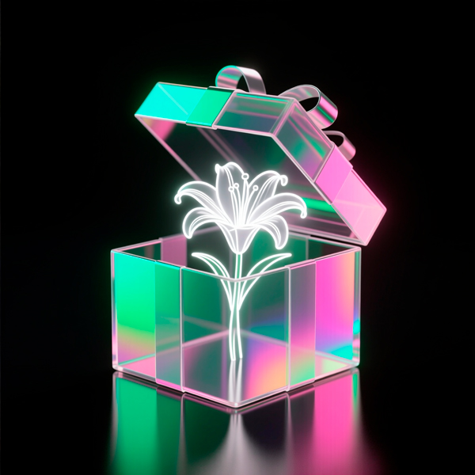
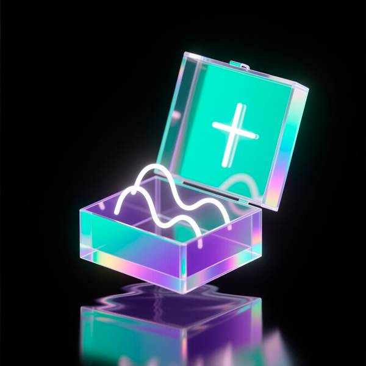
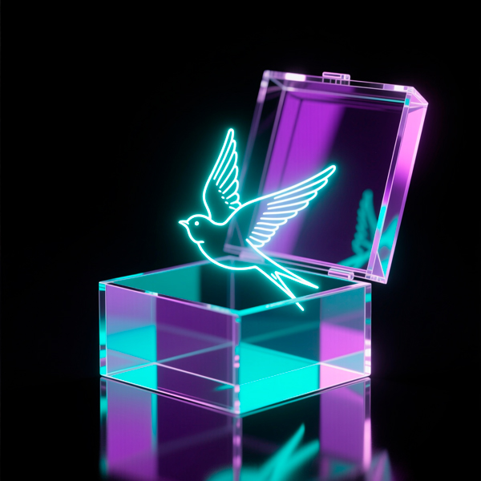
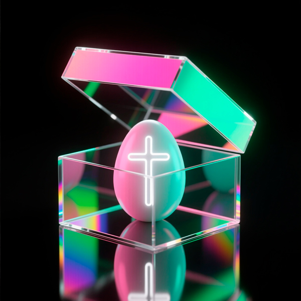
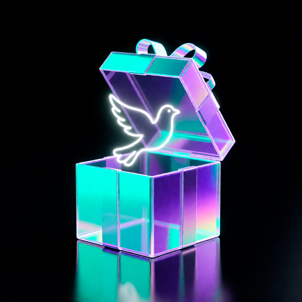
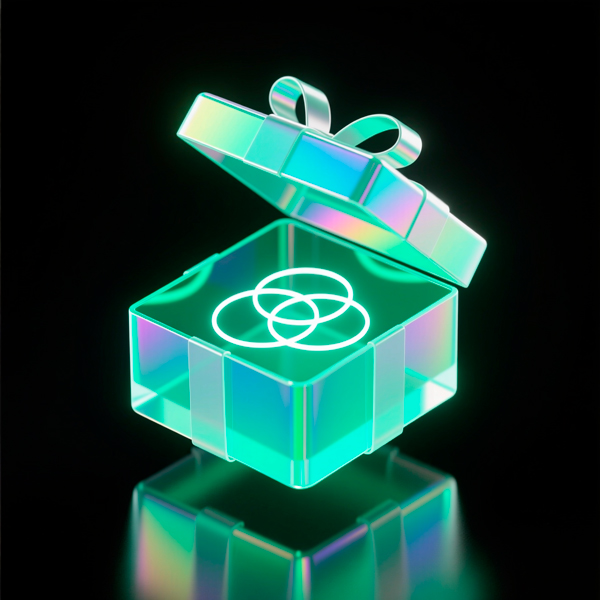
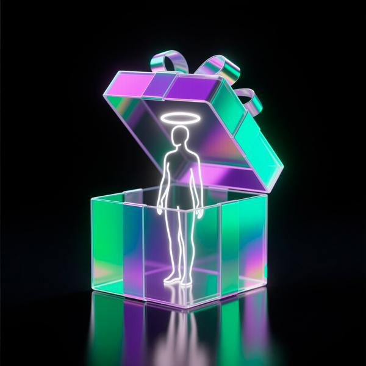
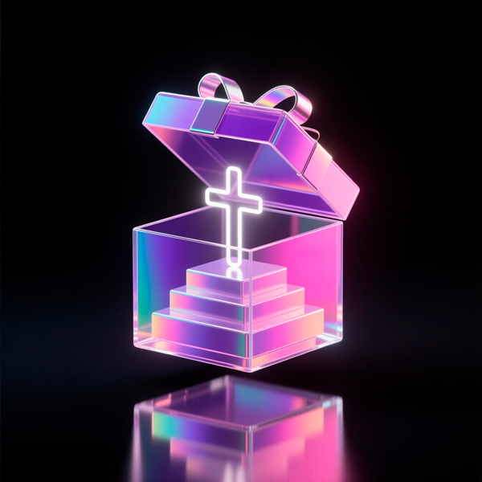

# Christian Collection
### Христианские праздники  
Глубокие, вдохновляющие сюрпризы к главным дням церковного года  

Подборка ботов для живых сообществ: праздники, внимание, вдохновение, духовные события.  
Последнее обновление: 29.01.2026

---

<table style="width: 100%; border-collapse: collapse; margin-bottom: 20px;">
  <tr>
    <td style="vertical-align: top; width: 0; padding: 0;">
      
    </td>
    <td style="vertical-align: top; padding-left: 15px;">
      <h3 style="margin-top: 0;">Благовещение</h3>
      
$10

    </td>
  </tr>
</table>
Сюрприз-согласие: тихое «да» тому, что уже рождается внутри

---

<table style="width: 100%; border-collapse: collapse; margin-bottom: 20px;">
  <tr>
    <td style="vertical-align: top; width: 0; padding: 0;">
      
    </td>
    <td style="vertical-align: top; padding-left: 15px;">
      <h3 style="margin-top: 0;">Крещение</h3>
      
$10

    </td>
  </tr>
</table>
Сюрприз-обновление: чувство ясности и нового начала в тишине души

---

<table style="width: 100%; border-collapse: collapse; margin-bottom: 20px;">
  <tr>
    <td style="vertical-align: top; width: 0; padding: 0;">
      
    </td>
    <td style="vertical-align: top; padding-left: 15px;">
      <h3 style="margin-top: 0;">Сретение</h3>
      
$10

    </td>
  </tr>
</table>
Сюрприз-встреча: момент, когда ожидание становится живым присутствием

---

<table style="width: 100%; border-collapse: collapse; margin-bottom: 20px;">
  <tr>
    <td style="vertical-align: top; width: 0; padding: 0;">
      
    </td>
    <td style="vertical-align: top; padding-left: 15px;">
      <h3 style="margin-top: 0;">Прощеное</h3>
      
$10

    </td>
  </tr>
</table>
Сюрприз-освобождение: прощение как шаг к свободе и миру

---

<table style="width: 100%; border-collapse: collapse; margin-bottom: 20px;">
  <tr>
    <td style="vertical-align: top; width: 0; padding: 0;">
      
    </td>
    <td style="vertical-align: top; padding-left: 15px;">
      <h3 style="margin-top: 0;">Вербное</h3>
      
$10

    </td>
  </tr>
</table>
Сюрприз-путь: радость движения вперёд с верой и внутренним светом

---

<table style="width: 100%; border-collapse: collapse; margin-bottom: 20px;">
  <tr>
    <td style="vertical-align: top; width: 0; padding: 0;">
      
    </td>
    <td style="vertical-align: top; padding-left: 15px;">
      <h3 style="margin-top: 0;">Пасха Христова</h3>
      
$10

    </td>
  </tr>
</table>
Сюрприз-воскресение: надежда на обновление и победу света

---

<table style="width: 100%; border-collapse: collapse; margin-bottom: 20px;">
  <tr>
    <td style="vertical-align: top; width: 0; padding: 0;">
      
    </td>
    <td style="vertical-align: top; padding-left: 15px;">
      <h3 style="margin-top: 0;">Вознесение</h3>
      
$10

    </td>
  </tr>
</table>
Сюрприз-присутствие: уверенность, что вы не одни, даже в тишине

---

<table style="width: 100%; border-collapse: collapse; margin-bottom: 20px;">
  <tr>
    <td style="vertical-align: top; width: 0; padding: 0;">
      
    </td>
    <td style="vertical-align: top; padding-left: 15px;">
      <h3 style="margin-top: 0;">Троица</h3>
      
$10

    </td>
  </tr>
</table>
Сюрприз-целостность: ощущение единства души, разума и сердца

---

<table style="width: 100%; border-collapse: collapse; margin-bottom: 20px;">
  <tr>
    <td style="vertical-align: top; width: 0; padding: 0;">
      
    </td>
    <td style="vertical-align: top; padding-left: 15px;">
      <h3 style="margin-top: 0;">Петр и Феврония</h3>
      
$10

    </td>
  </tr>
</table>
Сюрприз-верность: выбор быть рядом в доверии и любви, вопреки всему

---

<table style="width: 100%; border-collapse: collapse; margin-bottom: 20px;">
  <tr>
    <td style="vertical-align: top; width: 0; padding: 0;">
      
    </td>
    <td style="vertical-align: top; padding-left: 15px;">
      <h3 style="margin-top: 0;">Преображение</h3>
      
$10

    </td>
  </tr>
</table>
Сюрприз-свет: увидеть в себе больше, чем усталость и сомнения

---

<table style="width: 100%; border-collapse: collapse; margin-bottom: 20px;">
  <tr>
    <td style="vertical-align: top; width: 0; padding: 0;">
      
    </td>
    <td style="vertical-align: top; padding-left: 15px;">
      <h3 style="margin-top: 0;">Воздвижение</h3>
      
$10

    </td>
  </tr>
</table>
Сюрприз-опора: надежда, которая помогает устоять в трудный момент

---

<table style="width: 100%; border-collapse: collapse; margin-bottom: 20px;">
  <tr>
    <td style="vertical-align: top; width: 0; padding: 0;">
      
    </td>
    <td style="vertical-align: top; padding-left: 15px;">
      <h3 style="margin-top: 0;">Покров</h3>
      
$10

    </td>
  </tr>
</table>
Сюрприз-защита: ощущение заботы и покоя внутри

---

## 🧭 О коллекции

Christian — это коллекция ботов, посвящённая главным праздникам церковного года.  
Каждый бот приносит вдохновение, внимание и духовный смысл в сообщество.
